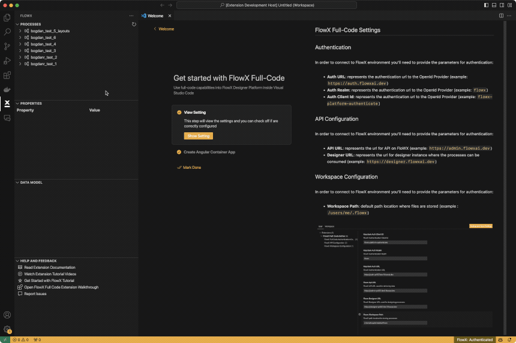

# FlowX Explorer

## Find information about your processes

Browse your favorite processes

- View properties for each node and action in the process
- View the assignated data model

## Find information about your processes

Edit business rules and use FlowX versioning to push modifications

- Intellisense for data model

