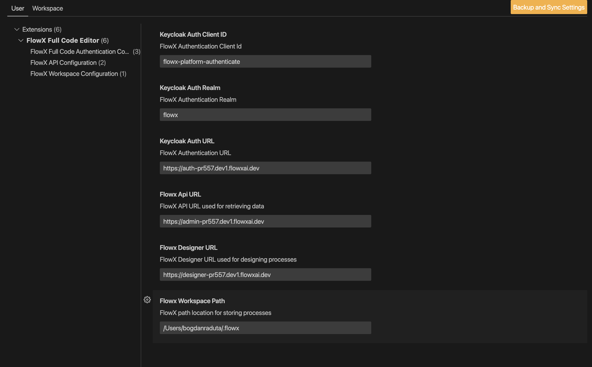

# FlowX Full-Code Settings

## Authentication

In order to connect to FlowX environment you'll need to provide the parameters for authentication:

- **Auth URL**: represents the authentication url to the OpenId Provider (example: `https://auth.flowxai.dev`)
- **Auth Realm**: represents the authentication url to the OpenId Provider (example: `flowx`)
- **Auth Client Id**: represents the authentication url to the OpenId Provider (example: `flowx-platform-authenticate`)

## API Configuration

In order to connect to FlowX environment you'll need to provide the parameters for authentication:

- **API URL**: represents the url for API on FloWX (example: `https://admin.flowxai.dev`)
- **Designer URL**: represents the url for designer instance where the processes can be consumed (example: `https://designer.flowxai.dev`)

## Workspace Configuration

In order to connect to FlowX environment you'll need to provide the parameters for authentication:

- **Workspace Path**: default path location where files are stored (example : `/users/me/.flowx`)

